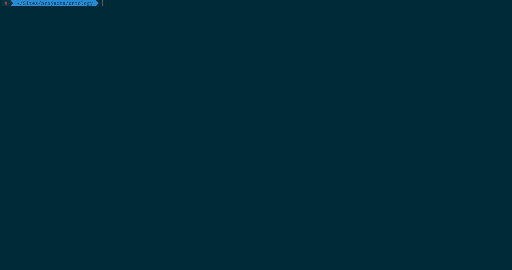

# Ontology

[![Latest Version on Packagist][ico-version]][link-packagist]

Explain and validate your domain with PHP Attributes and automatically generate documentation from it. 

## Installation

Via Composer

``` bash
$ composer require jeroen-g/ontology
```

## Usage



## Change log

Please see the [changelog](changelog.md) for more information on what has changed recently.

## Contributing

So you'd like to contribute? Awesome! Here is a (incomplete) list of things on the roadmap that you could start a PR on,
but feel free to suggest anything else!

- [ ] Dockerfile
- [ ] Ahoy/Makefile
- [ ] More attributes, such as:
    - [ ] Tag
    - [ ] SideEffect, SideEffectFree
    - [ ] Highlight
    - [ ] Bankrupt
    - [ ] BoundedContext
    - [ ] Factory
    - [ ] DataTransferObject
    - [ ] Command
    - [ ] Query
- [ ] Testing helpers, such as:
    - [ ] Get all classes with given attribute
    - [ ] Get all (DDD) attributes for a given class
    - protip: https://github.com/thephpleague/construct-finder
- More validators for all attributes, based on widely agreed conventions (e.g. value objects should have no setters)
- Does this work with custom, from outside the package, DDD attributes?

## Credits

- [Jeroen](https://github.com/jeroen-g)
- [All Contributors][link-contributors]

## License

MIT. Please see the [license file](license.md) for more information.

[ico-version]: https://img.shields.io/packagist/v/jeroen-g/ontology.svg?style=flat-square

[link-packagist]: https://packagist.org/packages/jeroen-g/ontology
[link-contributors]: ../../contributors
